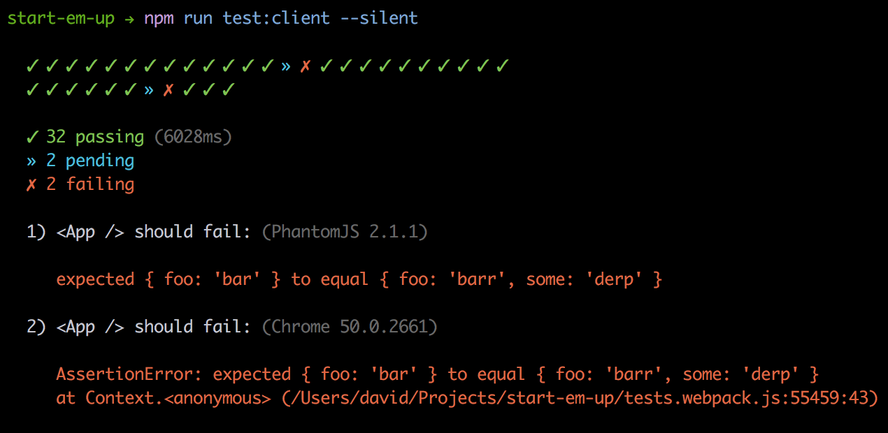

# mocha-checkmark-reporter

[](http://unmaintained.tech/)

Test reporter that prints small but useful results to console (for Mocha).
Supports diffing and smart error messages.

> Using `karma`? Check out [karma-checkmark-reporter](https://github.com/queicherius/karma-checkmark-reporter). 
Want to make one for your own testing framework? Check out [generic-checkmark-reporter](https://github.com/queicherius/generic-checkmark-reporter).



## Usage

```
npm install mocha-checkmark-reporter --save-dev
```

Use the reporter for mocha:

```
mocha -R mocha-checkmark-reporter
```
